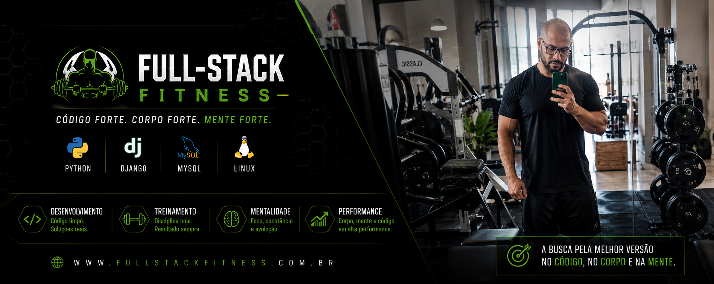

  

👋 Olá, eu sou Matheus Pinheiro

🏋️ Ex-professor de Educação Física em transição para Desenvolvimento Full Stack.

💻 Atualmente desenvolvendo aplicações reais com Python, Django e MySQL.

🚀 Criador dos projetos FitFlix e Full-Stack Fitness.

🛠️ Tecnologias

Projetos em destaque

FitFlix
Sistema de gerenciamento de treinos inspirado na experiência da Netflix.

Full-Stack Fitness
Blog onde documento minha jornada em tecnologia, fitness e construção de software.

 📈 Atualmente

- Aprendendo Django avançado
- Melhorando habilidades em Linux
- Desenvolvendo projetos reais para portfólio
- Publicando artigos técnicos

Código forte. Corpo forte. Mente forte.

<!--
**matheuspdev91/matheuspdev91** is a ✨ _special_ ✨ repository because its `README.md` (this file) appears on your GitHub profile.

Here are some ideas to get you started:

- 🔭 I’m currently working on ...
- 🌱 I’m currently learning ...
- 👯 I’m looking to collaborate on ...
- 🤔 I’m looking for help with ...
- 💬 Ask me about ...
- 📫 How to reach me: ...
- 😄 Pronouns: ...
- ⚡ Fun fact: ...
-->
